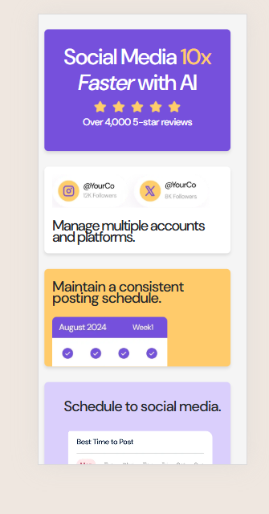

# Frontend Mentor - Bento grid solution

This is a solution to the [Bento grid challenge on Frontend Mentor](https://www.frontendmentor.io/challenges/bento-grid-RMydElrlOj). Frontend Mentor challenges help you improve your coding skills by building realistic projects.

## Table of contents

- [Overview](#overview)
  - [The challenge](#the-challenge)
  - [Screenshot](#screenshot)
  - [Links](#links)
- [My process](#my-process)
  - [Built with](#built-with)
  - [What I learned](#what-i-learned)
  - [Continued development](#continued-development)
  - [Useful resources](#useful-resources)
- [Author](#author)
- [Acknowledgments](#acknowledgments)

**Note: Delete this note and update the table of contents based on what sections you keep.**

## Overview

### The challenge

Users should be able to:

- View the optimal layout for the interface depending on their device's screen size

### Screenshot

## 🔍 Desktop Design

## 📱 Mobile View

### Links

- Solution URL: [Add solution URL here](https://github.com/hajarhabib2/Bento-grid)
- Live Site URL: [Add live site URL here](https://hajarhabib2.github.io/Bento-grid/)

### Built with

- Semantic HTML5 markup
- CSS custom properties
- Flexbox
- CSS Grid
- Bootstrap

## Author

- Website - [Hajar Habib](https://github.com/hajarhabib2)
- Frontend Mentor - [@hajarhabib2](https://www.frontendmentor.io/profile/hajarhabib2)
